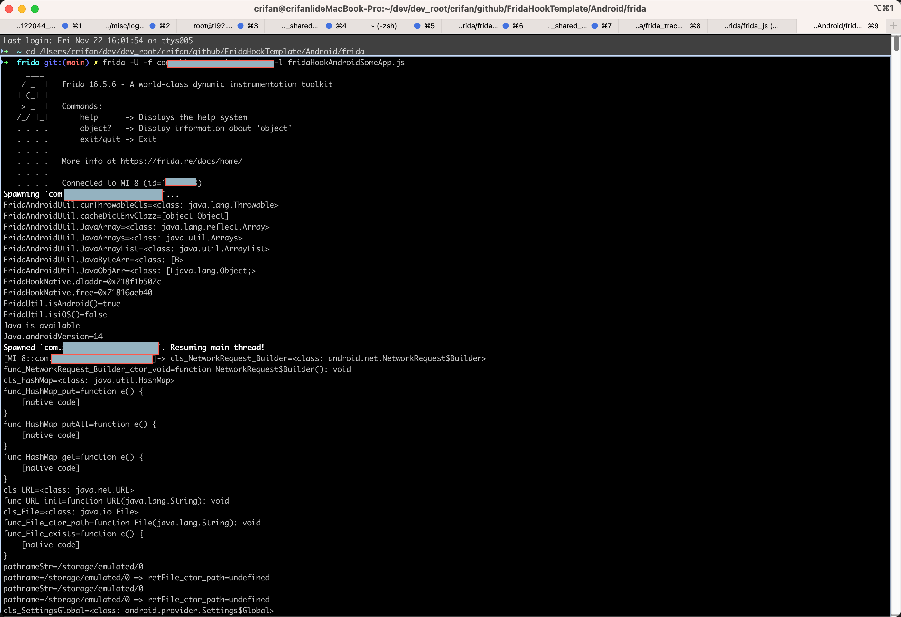

# FridaHookTemplate

* Update: `20260210`

## Function

Frida's hook template code for:

* Frida
  * Usage Type
    * frida js
      * Platform
        * Android
          * Normal Java Class
          * Native C
        * iOS
          * Normal ObjC Class
          * Native C
    * frida-trace commmands
  * interal use common part
    * Util
    * Hook

you can use this template for basic start of you using Frida to hook Android/iOS app/executable/lib

## Usage

### Common

#### Update latest Frida Util/Hook code

before use, copy/update latest frida util/hook code:

* [JsFridaUtil](https://github.com/crifan/JsFridaUtil/)
  * [JsUtil.js](https://github.com/crifan/JsFridaUtil/blob/main/JsUtil.js)
  * [Frida](https://github.com/crifan/JsFridaUtil/tree/main/frida)
    * common
      * Util
        * [FridaUtil.js](https://github.com/crifan/JsFridaUtil/blob/main/frida/FridaUtil.js)
      * Hook
        * Native
          * [FridaHookNative.js](https://github.com/crifan/JsFridaUtil/blob/main/frida/FridaHookNative.js)
    * Android
      * Util
        * [FridaAndroidUtil.js](https://github.com/crifan/JsFridaUtil/blob/main/frida/FridaAndroidUtil.js)
      * Hook
        * Java
          * [FridaHookAndroidJava.js](https://github.com/crifan/JsFridaUtil/blob/main/frida/FridaHookAndroidJava.js)
        * Native
          * [FridaHookAndroidNative.js](https://github.com/crifan/JsFridaUtil/blob/main/frida/FridaHookAndroidNative.js)
    * iOS
      * Util
        * [FridaiOSUtil.js](https://github.com/crifan/JsFridaUtil/blob/main/frida/FridaiOSUtil.js)
      * Hook
        * Native
          * [FridaHookiOSNative.js](https://github.com/crifan/JsFridaUtil/blob/main/frida/FridaHookiOSNative.js)

into your frida js:

* `Android/frida/fridaHookAndroidSomeApp.js`
* `iOS/frida/fridaHookiOSSomeApp.js`

### Frida hook Android 

```bash
cd /Users/crifan/dev/dev_root/crifan/github/FridaHookTemplate/Android/frida
```

then:

* hook by name
  ```bash
  frida -U -l fridaHookAndroidSomeApp.js -f com.app.package
  ```
  * Note:
    * change `com.app.package` to your real android app package name
      * cat get from `frida-ps -Uai`

or:

* hook via PID
  ```bash
  frida -U -l fridaHookAndroidSomeApp.js -p <PID>
  ```

-> Effect



### Frida hook iOS

## TODO

* [ ] add hook iOS app demo code
